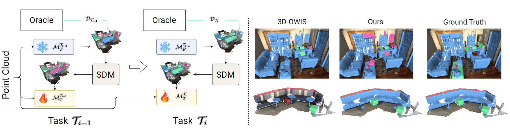

<div align="center">
 
## OpenDistill3D: Open-World 3D Instance Segmentation with Unified Self-Distillation for Continual Learning and Unknown Class Discovery <p> (ECCV 2024) </p> 

</div>

<div align="center">
<a href="">Mohamed El Amine Boudjoghra</a><sup>1</sup>, <a href=""> Jean Lahoud</a><sup>1</sup>, <a href="">Hisham Cholakkal</a><sup>1</sup>, <a href="">Rao Muhammad Anwer</a><sup>1,2</sup>,  <a href="">Salman Khan</a><sup>1,3</sup>, <a href="">Fahad Khan</a><sup>1,4</sup>

<sup>1</sup>Mohamed Bin Zayed University of Artificial Intelligence (MBZUAI) <sup>2</sup>Aalto University <sup>3</sup>Australian National University <sup>4</sup>Linköping University
</div>

<br>


### News

<!-- * **25 September 2023**: [Open]() released on arXiv. 📝 -->
* **05 July 2024**: Code and trained models released. 💻
* **01 July 2024**: Paper accepted into <b>ECCV2024</b>. 🥳


### Abstract
Open-world 3D instance segmentation is a recently intro-
duced problem with diverse applications, notably in continually learning
embodied agents. This task involves segmenting unknown instances, and
learning new instances when their labels are introduced. However, prior
research in the open-world domain has traditionally addressed the two
sub-problems, namely continual learning and unknown object identifi-
cation, separately. This approach has resulted in limited performance
on unknown instances and cannot effectively mitigate catastrophic for-
getting. Additionally, these methods bypass the utilization of the infor-
mation stored in the previous version of the continual learning model,
instead relying on a dedicated memory to store historical data samples,
which inevitably leads to an expansion of the memory budget. In this
paper, we argue that continual learning and unknown class identification
should be tackled in conjunction. Therefore, we propose a new exemplar-
free approach for 3D continual learning and the discovery of unknown
classes through self-distillation. Our approach leverages the pseudo-labels
generated by the model from the preceding task to improve the un-
known predictions during training while simultaneously mitigating catas-
trophic forgetting. By integrating these pseudo-labels into the continual
learning process, we achieve enhanced performance in handling unknown
classes. We validate the efficacy of the proposed approach via compre-
hensive experiments on various splits of the ScanNet200 dataset, show-
casing superior performance in continual learning and unknown class
retrieval compared to the state-of-the-art. 



<div align="center">

**Figure I:** Proposed open-world 3D instance segmentation pipeline.

 </div>

## Installation guide

Kindly check [Installation guide](./Installation.md) on how to setup the Conda environment and how to preprocess ScanNet200 dataset.


## BibTeX :pray:
```
```
